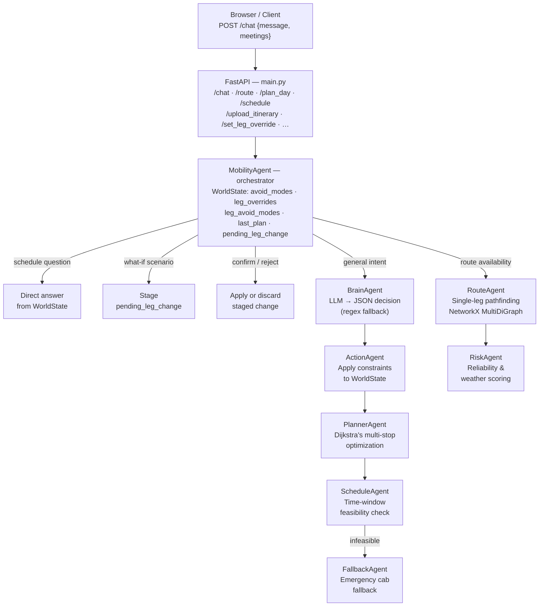

# Mumbai Mobility Agent

A conversational AI assistant that helps you navigate Mumbai's multi-modal transit network — by simply talking to it.

---

## The Problem

Mumbai has one of the most complex urban transit networks in the world: local trains, metro lines, BEST buses, and cabs all operate in parallel, with overlapping routes, different reliability profiles, and wildly different costs. Planning a multi-stop day across this network is frustrating. You end up juggling apps, second-guessing connections, and manually accounting for your own constraints — "I hate crowded trains", "I can't walk far", "I have a meeting at 10".

No single tool lets you say *"plan my day, but avoid trains and use cab only for the last leg"* and actually get a coherent, time-validated plan back.

---

## What This Does

Mumbai Mobility Agent is a **conversational route optimizer**. You describe your day in natural language — stops, preferences, constraints, times — and the agent figures out the best path through the network.

### What you can ask it

- **Plan a multi-stop day**
  > "I need to go from Andheri to Dadar, then Dadar to Churchgate, then back home by 9 PM"

- **Apply constraints naturally**
  > "Avoid trains today" / "Use only metro and bus" / "No cabs on the Bandra to Dadar leg"

- **Override specific legs**
  > "Force cab from Kurla to BKC — I have luggage"

- **Ask what-if questions**
  > "What if I take cab instead of metro for the first leg?"

- **Check feasibility and timing**
  > "Can I make it from Andheri to CST by 9 AM?"

- **Handle conflicts and follow-ups**
  > The agent remembers your constraints across the conversation and resolves conflicts — for example, if you avoid trains globally but try to force a train on one leg, it surfaces the conflict and asks what you want to do.

- **Export your plan**
  > Download your optimized itinerary as a structured summary.

---

## How Constraints Work

You can set preferences at two levels:

- **Global**: "Avoid trains" applies to your entire day
- **Per-leg**: "Use cab from Bandra to BKC" applies only to that leg

Both persist across the full conversation. When they conflict, the agent surfaces the issue to you rather than silently picking one.

---

## Why No LangChain

This project deliberately avoids LangChain or any other LLM orchestration framework. The entire agent pipeline — intent parsing, decision routing, state management, constraint resolution, and fallback logic — is built from scratch in Python.

This was a conscious choice to deeply understand what LLM orchestration actually requires: how to structure prompts, how to validate and parse structured outputs reliably, how to handle LLM failures gracefully, and how to maintain multi-turn conversational state without a framework doing it for you.

The result is a lean, transparent stack with no hidden abstractions.

---

## Transport Modes

| Mode | Character |
|------|-----------|
| Metro | Fast urban corridors, high reliability |
| Local Train | Long-distance suburban links, low cost |
| Bus | Last-mile and cross-city, most flexible |
| Cab | On-demand, best for luggage or accessibility |

Routes are scored on **duration**, **cost**, and **reliability** — with traffic multipliers per mode.

---

## Setup

```bash
python -m venv venv
source venv/bin/activate       # Windows: venv\Scripts\activate
pip install -r requirements.txt
cp .env.example .env           # Add your OPENROUTER_API_KEY
uvicorn main:app --reload --port 8001
```

Open `http://127.0.0.1:8001/` in your browser.

Get a free API key at [openrouter.ai](https://openrouter.ai).

---

## Eval Results

The system is scored across 7 areas using an offline eval harness (`eval/`). Results below are from `eval_20260404_231641`.

| Area | Score | Status |
|------|-------|--------|
| Constraint Application | 100% | PASS |
| Schedule Feasibility | 100% | PASS |
| Conversation Flow | 100% | PASS |
| Route Optimization | 98% | PASS |
| What-If Scenarios | 87.3% | PASS |
| Route Availability | 79% | FAIL |
| LLM Intent Parsing | 70.7% | FAIL |
| **Overall** | **90.7%** | **5/7 areas passing** |

**Per-metric breakdown:**

| Metric | Score |
|--------|-------|
| Intent classification accuracy | 287/400 (71.8%) |
| Location extraction accuracy | 560/560 (100%) |
| Mode extraction accuracy | 200/290 (69%) |
| Fallback rate (lower is better) | 50/400 (12.5%) |
| Parse success rate | 400/400 (100%) |
| Global avoid stored correctly | 32/32 (100%) |
| Leg avoid stored correctly | 68/68 (100%) |
| Leg override stored correctly | 110/110 (100%) |
| Conflict detection rate | 34/34 (100%) |
| Route validity rate | 212/230 (92.2%) |
| Constraint compliance | 100/100 (100%) |
| Leg constraint compliance | 50/50 (100%) |
| Infeasibility detection | 40/40 (100%) |
| Schedule sort order | 80/80 (100%) |
| Multi-turn state persistence | 119/119 (100%) |
| Conflict surfacing | 40/40 (100%) |
| What-if preview trigger | 30/30 (100%) |
| What-if pending state | 24/35 (68.6%) |
| What-if confirmation | 14/15 (93.3%) |
| Route check status | 80/100 (80%) |
| Route availability flag | 78/100 (78%) |

Run the eval yourself:

```bash
python -m eval.run_eval          # all areas
python -m eval.run_eval --area intent
python -m eval.run_eval --area whatif
python -m eval.run_eval --area availability
```

---

## System Design



### Data & Services

```
data/
  mumbai_routes.py     12-location, 4-mode transport graph
                       Edge weights: duration · cost · reliability

services/
  llm.py               OpenRouter API client (2 retries)
  output_formatter.py  Plan → human-readable response
  time_utils.py        Time window helpers

models/
  world_state.py       Conversation state (constraints, last plan)
  plan.py              PlanRequest / PlanResult types
  route.py             RouteRequest type
  meeting.py           Meeting type
```

### Transport Scoring Formula

```
score = duration × (2 − reliability) × traffic_multiplier
```

Lower score = better route. Planner runs Dijkstra's on this weight across all legs, then applies constraint filters before returning the optimal plan.

---

## File Structure

```
.
├── main.py                      FastAPI app & API routes
├── index.html                   Single-page frontend
├── requirements.txt
├── .env.example
├── sample_itinerary.csv         Example CSV for /upload_itinerary
│
├── agents/
│   ├── mobility_agent.py        Main orchestrator + WorldState manager
│   ├── brain_agent.py           LLM intent parsing → structured decision
│   ├── action_agent.py          Applies decisions to WorldState
│   ├── planner_agent.py         Multi-stop Dijkstra optimizer
│   ├── schedule_agent.py        Time-window feasibility validator
│   ├── route_agent.py           Single-leg pathfinding (NetworkX)
│   ├── risk_agent.py            Reliability / weather risk scorer
│   └── fallback_agent.py        Emergency cab fallback
│
├── models/
│   ├── world_state.py           Conversational state (constraints, plan)
│   ├── plan.py                  PlanRequest / PlanResult
│   ├── route.py                 RouteRequest
│   └── meeting.py               Meeting
│
├── data/
│   ├── mumbai_routes.py         12-location NetworkX MultiDiGraph
│   └── __init__.py
│
├── services/
│   ├── llm.py                   OpenRouter client (retry logic)
│   ├── output_formatter.py      Plan → readable text
│   └── time_utils.py            Time helpers
│
├── eval/
│   ├── run_eval.py              Eval harness entry point
│   ├── report.py                Score aggregation & reporting
│   ├── models.py                Eval data models
│   ├── evaluators/
│   │   ├── intent_eval.py
│   │   ├── constraint_eval.py
│   │   ├── route_eval.py
│   │   ├── schedule_eval.py
│   │   ├── conversation_eval.py
│   │   ├── whatif_eval.py
│   │   └── availability_eval.py
│   └── fixtures/
│       ├── intent_parsing.json
│       ├── constraint_application.json
│       ├── route_optimization.json
│       ├── schedule_feasibility.json
│       ├── conversation_flow.json
│       ├── whatif.json
│       └── availability.json
│
└── run_feature_suite.py         Integration test suite
    run_endtoend_test.py         End-to-end test suite
```

---

## Requirements

- Python 3.9+
- An OpenRouter API key (free tier works)
